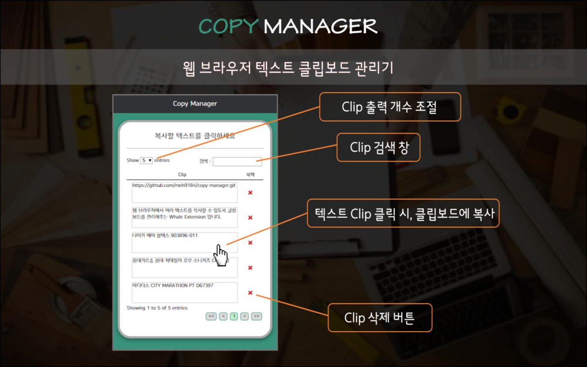
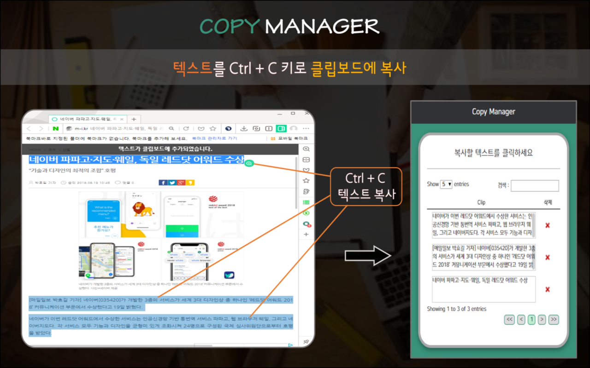
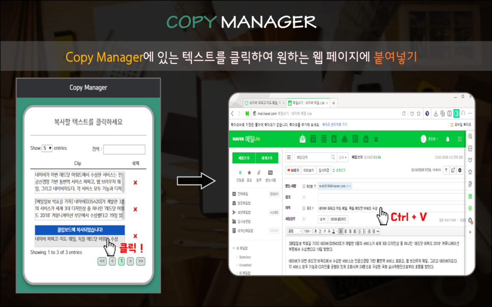
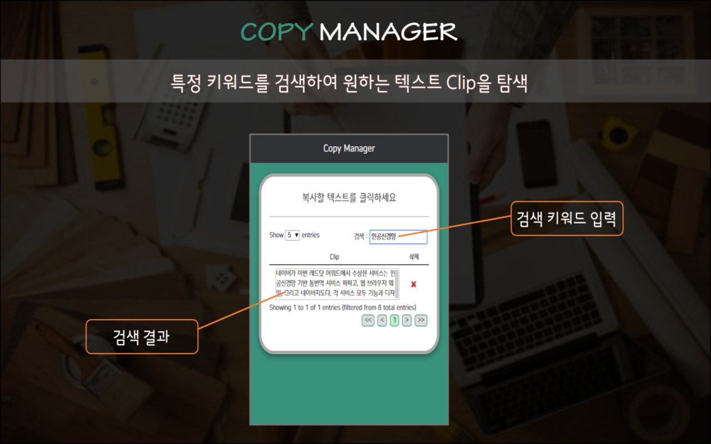

# copy-manager
> 웹 브라우저에서 여러 텍스트를 복사할 수 있도록 클립보드를 관리해주는 Whale Extension

<div>
  <div width='100%'>
    
    
  </div>
  <div width='100%'>
    
    
  </div>
</div>
<br>

클립보드에 저장된 여러 텍스트, [Copy Manager](https://store.whale.naver.com/detail/kaimiajcapodfiigpgglolbnbhpmopjo)를 통해 효율적으로 사용해보세요!

## 설치 방법

[사용자 모드]
1. [웨일 브라우저](https://whale.naver.com) 다운로드 및 설치
2. [Copy Manager](https://store.whale.naver.com/detail/kaimiajcapodfiigpgglolbnbhpmopjo) 페이지 들어가서 '웨일에 추가하기' 클릭

[개발자 모드]

```
$ git clone https://github.com/meh9184/copy-manager
$ cd copy-manager
$ npm install
$ npm run build
```

[웨일 개발자 센터](https://developers.whale.naver.com/tutorials/debugging/)에서 안내하는 대로, clone한 `확장앱 소스폴더`를 로드


## 주요 기능
- Copy Manager 버튼 클릭 / Alt+C : 클립보드 페이지 올림/내림
- 텍스트 클릭 : 해당 텍스트를 클립보드에 복사
- 삭제 버튼 클릭 : 해당 텍스트를 클립보드에서 삭제
- 검색 : 특정 키워드가 포함된 텍스트 클립을 검색


## 사용 방법

[단축키]
- Windows
  - Alt+C : 클립보드 페이지 올림 / 내림 


[이렇게 사용해보세요]
- 단축키 Ctrl+C 로 텍스트를 복사한 이후에, Copy Manager 단축키 Alt+C를 사용하여 복사된 내역을 확인해보세요.


[이럴 때 사용해보세요]
- 연속적이지 않은 특정 텍스트 정보를 복사해야할 때
  -> 각 텍스트마다 드래그+복사를 수행한 뒤 Copy Manager를 열어 차례로 붙여넣기 수행

- 과거에 복사했던 이력을 다시 사용해야하는 상황이 생겼을 때
  -> 클립보드를 열어 (Alt+C) 과거에 사용했던 텍스트의 키워드를 검색 


## 개발 진행중인 추가 기능
- 클립보드 텍스트 편집 기능
- 클립보드 텍스트 전체 삭제 기능
- 클립보드 이미지 추가 기능


## 업데이트 내역

* 1.0.0 (2018.01.16)  
    * 확장앱 배포  

* 1.1.0 (2019.01.23)
    * 수정: Clip 삭제시 테이블 업데이트 되지 않던 문제 해결 
    * 추가: Clip 전체삭제 버튼 추가
    

## 정보

[Eunhwan Moon](https://github.com/meh9184) – meh9184@naver.com


## 기여 방법

1. <https://github.com/meh9184/copy-manager/fork>을 포크합니다.
2. `git checkout -b feature/fooBar` 명령어로 새 브랜치를 만드세요.
3. `git commit -am 'Add some fooBar'` 명령어로 커밋하세요.
4. `git push origin feature/fooBar` 명령어로 브랜치에 푸시하세요. 
5. 풀리퀘스트를 보내주세요.

<!-- Markdown link & img dfn's -->
[npm-image]: https://img.shields.io/npm/v/datadog-metrics.svg?style=flat-square
[npm-url]: https://npmjs.org/package/datadog-metrics
[npm-downloads]: https://img.shields.io/npm/dm/datadog-metrics.svg?style=flat-square
[travis-image]: https://img.shields.io/travis/dbader/node-datadog-metrics/master.svg?style=flat-square
[travis-url]: https://travis-ci.org/dbader/node-datadog-metrics
[wiki]: https://github.com/yourname/yourproject/wiki
